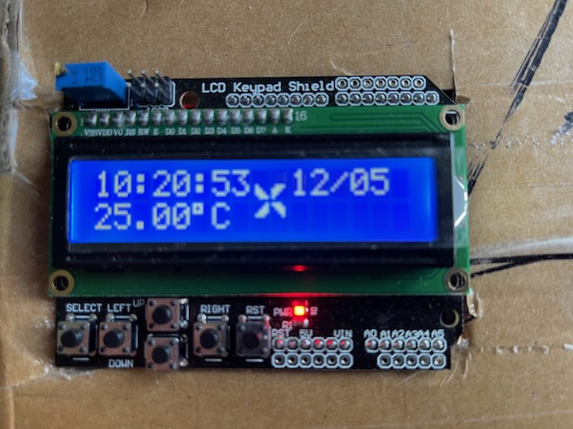

# ARDUINO - DOMESTIC HOT WATER CIRCUIT

### Short description
This project helps increasing the efficiency of the domestic hot water circulation using the Arduino device controlling the pump.

## Description
The aim of the project is to reduce the use of energy and water in households. Due to the large distance between the hot water tank and the tap, and in order to have hot water at the tap outlet constantly, the pump needs to be running on and on. This significantly increases the comfort of the household, but unnecessarily consumes electricity (a pump has  ~50W) and natural gas consumed by the central heating furnace. What's more, hot water circulating in the pipes unnecessarly use the energy to heat the walls of the building. For example, why should the pump run at night when no one will use the water for at least a few hours?

A more energy-efficient solution is to remove the pump. However, then we significantly increase the water consumption (the volume of water that fits between the hot water tank and the tap), which must overflow before we get hot water. So that it is not a friendly solution, neither for the environment nor for our wallet.

The solution to the problem is to use a driver that will automatically turn on/off the pump. It can happen either at certain times of the day, when the activity of the household is the highest, or ( in the case of irregularities) when the person turns on the tap (a second is enough). The controller will constantly monitor the pipe temperature approximately 30 cm behind the stove. When hot water is not used for a long time and the circulation pump is turned off, the temperature behind the stove will drop. When you open any tap in the house, hot water will start to flow and heat the pipe. This sudden change will be detected by the controller which will turn on the pump for a specified period of time, for example 1 minute. After waiting a few seconds, you can turn on the tap again and it should be warm water.

The controller can be programmed by the user using the buttons and display in the following scope:

- the minimum temperature, difference, and time when the change took place, which will be identified as opening one of the taps
- hourly and weekly schedule of circulation pump activation

The controller will be equipped with:

- an Arduino,
- thermistor, 
- display with buttons,
- pump control relay,
- power supply.

## Schema

### Software
- IDE: VisualStudioCode + PlatformIO
- 7 displays
	- main screen (time, temperature, pump indicator)
	- minimum temperature setting
	- rise temperature setting
	- temperature check setting
	- Timer 1 setting
	- Timer 2 setting
	- Time setting

### Hardware
- ArduinoUno
- Thermistor DS18B20 (to read the temperature)
- 1-channel relay module L / H 5V 10A Arduino AVR (turning on/off the pump)
- Arduino Shield (display and buttons)
- RTC DS3231 battery  (to keep user settings)

### Sample main screen

### Credits
2022 © howkymike